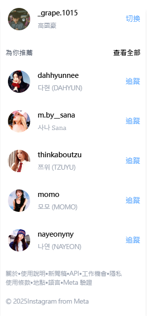
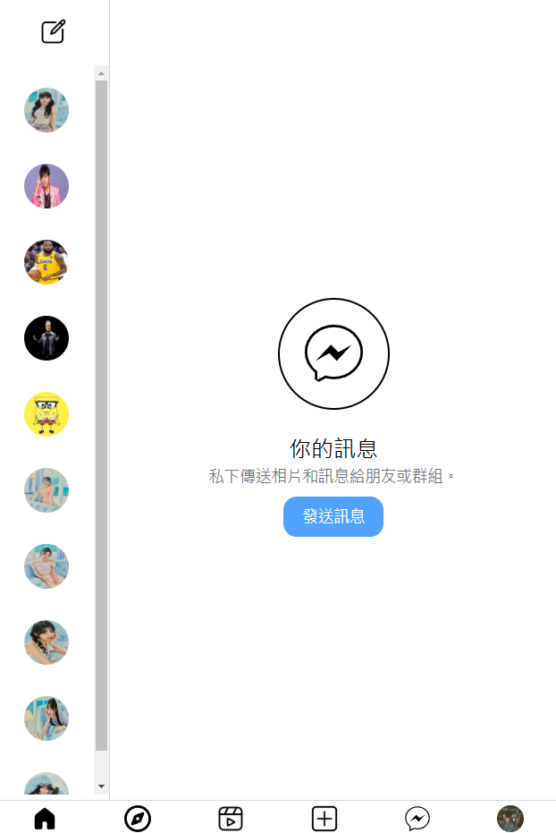
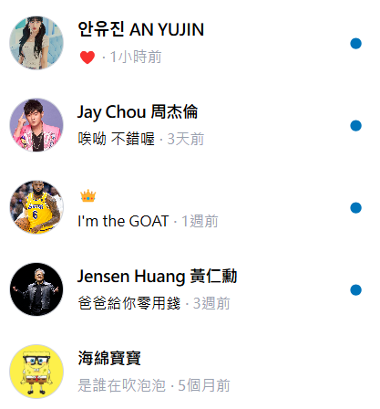
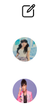
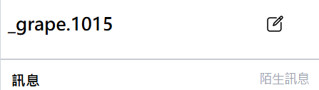
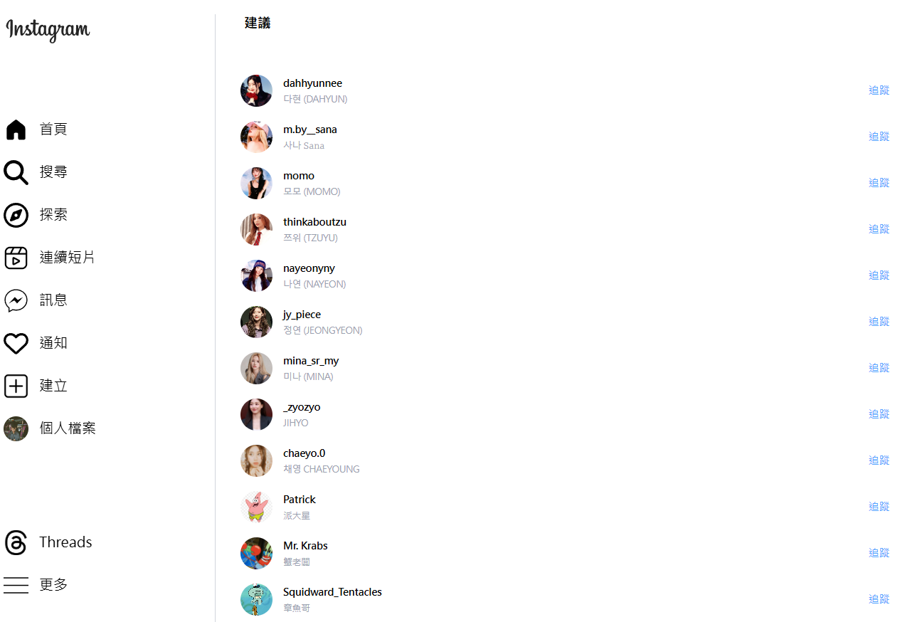
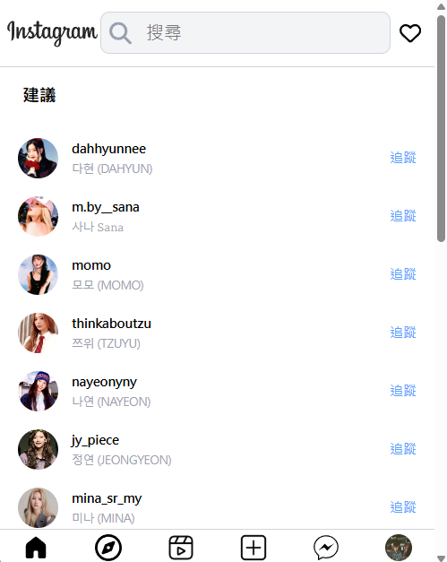

# React + TypeScript + Vite -Instagram 風格社群網站開發

## Overview

- [設定 Tailwind CSS](#設定-tailwind-css)
- [routes.tsx](#routestsx)
- [pages > Home > index.tsx](#pages-home-indextsx)
- [pages > ChatRoom > index.tsx](#pages-ChatRoom-indextsx)
- [pages > Explore > index.tsx](#pages-Explore-indextsx)
- [redux](#redux)
- [main.tsx](#main.tsx)
- [server.js](#server.js)

## Architecture Design & Explanation

### 設定 Tailwind CSS

1.在終端機執行以下指令:

```sh
npm install tailwindcss @tailwindcss/vite
```

2.在 vite.config.ts 新增:

```ts
import tailwindcss from "@tailwindcss/vite";

plugins: [tailwindcss()],
```

3.在 src/index.css 加入 Tailwind 的基礎樣式:

```css
@import "tailwindcss";
```

### [routes.tsx](https://github.com/HHowardKao/React-Instagram/blob/main/src/routes.tsx)

定義應用程式的路由，使用 react-router-dom 來管理不同頁面的導覽

```tsx
import { RouteObject } from "react-router-dom";
import Home from "./pages/Home";
import NotFound from "./pages/NotFound";
import ChatRoom from "./pages/ChatRoom";

const routes: RouteObject[] = [
  {
    path: "/",
    element: <Home />,
  },
  {
    path: "/chatroom",
    element: <ChatRoom />,
  },
  {
    path: "*",
    element: <NotFound />,
  },
];
```

- RouteObject 是 react-router-dom 提供的類型定義，表示一個路由物件。
- routes 是一個陣列，包含應用程式的所有路由設定
- path: "/" → 代表首頁，對應到 Home 元件
- path: "/chatroom" → 代表聊天室頁面，對應到 ChatRoom 元件
- path: "\*" → 代表任何未匹配的路由，顯示 NotFound 元件

### [pages > Home > index.tsx](https://github.com/HHowardKao/React-Instagram/blob/main/src/pages/Home/index.tsx)

定義首頁 (Home) 的結構與版面配置

#### 主頁包含的元件:

```tsx
import Container from "../../components/Container";
import Navbar from "../../components/Navbar";
import Sidebar from "../../components/Sidebar";
import Story from "./components/Story/Story";
import Post from "./components/Post/post";
import Recommend from "./components/Recommend/recommend";
import Bottombar from "../../components/Bottombar";
```

- Container：用於包裝主要內容，可能用於設定頁面寬度或增加間距。
- Navbar：頂部的導航列，適用於行動裝置 (lg:hidden 指在桌機版隱藏)。
- Sidebar：左側選單，僅在桌機版 (lg:block) 顯示。
- Story：顯示限時動態 (Story) 的元件。
- Post：顯示貼文 (Post) 的元件。
- Recommend：右側推薦內容 (Recommend)，僅桌機版顯示。
- Bottombar：底部導航欄，僅行動裝置顯示 (lg:hidden)。

#### [Container](https://github.com/HHowardKao/React-Instagram/blob/main/src/components/Container.tsx)

建立一個響應式的版面容器 (Container)

```tsx
import styled from "styled-components";

const Container = styled.div`
  max-width: 1024px;
  margin: 0 auto;

  @media only screen and (max-width: 1024px) {
    max-width: 100%;
  }
`;
```

- styled-components 是一個 CSS-in-JS 解決方案，允許我們在 React 中直接撰寫 CSS 樣式，並封裝成 React 元件。
- max-width: 1024px;
  - 預設最大寬度為 1024px，適合桌機版的顯示。
- margin: 0 auto;
  - 讓 Container 水平置中，使內容對齊畫面中央。
- @media only screen and (max-width: 1024px)
  - 當螢幕寬度小於 1024px（如平板或手機），max-width 會變成 100%，適應較小的裝置。

#### [Navbar](https://github.com/HHowardKao/React-Instagram/blob/main/src/components/Navbar.tsx)、[Sidebar](https://github.com/HHowardKao/React-Instagram/blob/main/src/components/Sidebar.tsx)、[Bottombar](https://github.com/HHowardKao/React-Instagram/blob/main/src/components/Bottombar.tsx)

分別定義應用程式的頂部導航列 (Navbar)、側邊欄 (Sidebar)、底部導航列 (Bottombar)

```tsx
import { Link } from "react-router-dom";
```

Link 是 react-router-dom 提供的路由導覽元件，允許應用程式內部進行無刷新的頁面跳轉

#### [電腦版主頁截圖畫面](#alttext1)


#### [手機版主頁截圖畫面](#alttext2)


#### [Story](https://github.com/HHowardKao/React-Instagram/tree/main/src/pages/Home/components/Story)

- Item.tsx:建立一個使用者頭像 (avatar) 與帳號 (account) 元件
- Story.tsx:顯示限時動態 (Stories) 的 UI

```tsx
import Item from "./Item";
import { useGetIGStoiesQuery } from "../../../../redux/Homeservices";
```

1. 從 Redux API (useGetIGStoiesQuery) 取得限時動態列表
2. 使用 Item 元件來顯示每個動態的頭像與使用者名稱

#### [限時動態截圖畫面](#alttext3)


#### [Post](https://github.com/HHowardKao/React-Instagram/tree/main/src/pages/Home/components/Post)

- comment.tsx:顯示貼文的互動資訊，包括：按讚數、留言數、貼文描述、發文者帳號、發文時間
- images.tsx:顯示貼文的圖片
- user.tsx:顯示貼文發佈者的頭像與帳號名稱
- Post.tsx:顯示貼文 (Posts) 的 UI

```tsx
import React from "react";
import { useGetIGPostsQuery } from "../../../../redux/Homeservices";
import Comment from "./comment";
import User from "./user";
import Image from "./image";
```

1. 透過 useGetIGPostsQuery 從 Redux 取得貼文資料。
2. 使用 User、Image 和 Comment 三個元件來組成每則貼文：

- User：顯示發文者資訊（頭像 + 帳號）。
- Image：顯示貼文圖片。
- Comment：顯示按讚數、留言數、貼文描述與發文時間。

#### [PO 文截圖畫面](#alttext4)


#### [Recommend](https://github.com/HHowardKao/React-Instagram/tree/main/src/pages/Home/components/Recommend)

- user.tsx:顯示使用者資訊 (頭像 + 帳號 + 名稱 + 追蹤按鈕)
- recommend.tsx:顯示推薦用戶清單

#### [推薦列表截圖畫面](#alttext5)



### [pages > ChatRoom > index.tsx](https://github.com/HHowardKao/React-Instagram/blob/main/src/pages/ChatRoom/index.tsx)

建立聊天室 (ChatRoom) 頁面，用來管理和顯示使用者的聊天訊息

#### 聊天室包含的元件:

```tsx
import Container from "../../components/Container";
import Friend from "./components/friend/friend";
import Bottombar from "../../components/Bottombar";
import Sidebar from "./components/sidebar/sidebar";
import Friends from "./components/friend/friends";
import Chatuser from "./components/chatuser/chatuser";
```

- Container：用來包裝聊天室區塊，提供固定的頁面布局
- Sidebar：顯示在左側的側邊欄（僅桌機版）
- Friend / Friends：負責顯示好友清單（行動版顯示 Friend，桌機版顯示 Friends）
- Chatuser：用來顯示當前聊天對象或聊天對話
- Bottombar：在行動版中顯示底部導航列

#### [電腦版聊天室截圖畫面](#alttext9)


#### [手機版聊天室截圖畫面](#alttext10)



#### [chatuser](https://github.com/HHowardKao/React-Instagram/tree/main/src/pages/ChatRoom/components/chatuser)

- user.tsx:顯示聊天室中的用戶訊息預覽
  - 頭像 (image)、名稱 (name)、最近訊息 (message)、時間 (time)。
  - 區分已讀(flag=false) → 灰色訊息/ 未讀訊息(flag=true) → 黑色訊息，右側顯示 🔵
- chatuser.tsx:顯示用戶的聊天清單

```tsx
import User from "./user";
import { useGetIGChatsQuery } from "../../../../redux/Homeservices";
```

1. 透過 Redux API 取得聊天清單 (chats)
2. 使用 User 元件顯示每個聊天對象

#### [聊天室訊息截圖畫面](#alttext6)



#### [friend](https://github.com/HHowardKao/React-Instagram/tree/main/src/pages/ChatRoom/components/friend)

- friend.tsx:在手機版聊天室 (ChatRoom) 顯示好友列表
- friends.tsx:顯示電腦版聊天室的頂部好友資訊區塊

#### [手機版好友列表截圖畫面](#alttext7)



#### [電腦版好友列表頂部截圖畫面](#alttext8)



### [pages > Explore > index.tsx](https://github.com/HHowardKao/React-Instagram/blob/main/src/pages/Explore/index.tsx)

建立「探索 (Explore) 頁面」，讓使用者可以探索其他用戶

#### 探索頁面包含的元件:

```tsx
import Container from "../../components/Container";
import Sidebar from "../../components/Sidebar";
import Bottombar from "../../components/Bottombar";
import Navbar from "../../components/Navbar";
import People from "./components/people";
```

- People：主要內容區，用來顯示「探索」的人員。

#### [電腦版探索頁面截圖畫面](#alttext10)



#### [手機版探索頁面截圖畫面](#alttext11)



#### [people](https://github.com/HHowardKao/React-Instagram/blob/main/src/pages/Explore/components/people.tsx)

1. 在「探索（Explore）」頁面中顯示推薦用戶清單
2. 從 Redux Store 取得推薦用戶清單
3. 使用 User 元件顯示每位推薦好友資訊與追蹤按鈕

```tsx
import { useAppSelector } from "../../../redux/hooks";
import User from "../../Home/components/Recommend/user";
```

- useAppSelector：自訂 Redux Hook，用來從 Store 中選取資料（這裡用於取得 friends 推薦清單）。
- User：重複使用 Home 頁面中的推薦用戶元件，來顯示用戶頭像、帳號、名稱與追蹤按鈕。

```tsx
const friendReducer = useAppSelector((state) => state.friendReducer);
const friends = friendReducer.friends;
```

- 從 Redux Store 中取得 friendReducer：Redux 有設定 friendReducer，並且內部有一個 friends 陣列。

### [redux](https://github.com/HHowardKao/React-Instagram/tree/main/src/redux)

#### [Friendslice.ts](https://github.com/HHowardKao/React-Instagram/blob/main/src/redux/Friendslice.ts)

- 提供推薦好友資料清單。
- 可透過 Redux Action 進行追蹤 / 取消追蹤操作。
- 與 Recommend, People 頁面整合，動態顯示追蹤狀態（透過 flag 控制）。

```ts
export const friendSlice = createSlice({
  name: "friendsList",
  initialState,
  reducers: {
    follow: (state, action: PayloadAction<number>) => {
      const friends = state.friends;
      for (let i = 0; i < friends.length; i++) {
        if (friends[i].id === action.payload) {
          friends[i].flag = true;
        }
      }
    },
    unFollow: (state, action: PayloadAction<number>) => {
      const friends = state.friends;
      for (let i = 0; i < friends.length; i++) {
        if (friends[i].id === action.payload) {
          friends[i].flag = false;
        }
      }
    },
  },
});
```

Reducer 說明：

- follow：接收 id 作為參數。找到對應好友，將其 flag 設為 true（已追蹤）。
- unFollow：找到對應好友，將其 flag 設為 false（取消追蹤）。

```ts
export const { follow, unFollow } = friendSlice.actions;
export default friendSlice.reducer;
```

- 匯出 follow / unFollow Action，供元件中調用（改變追蹤狀態）。
- 匯出 reducer 供 store.ts 註冊進 Redux Store。

#### [Homeservices.ts](https://github.com/HHowardKao/React-Instagram/blob/main/src/redux/Homeservices.ts)

使用 Redux Toolkit Query 來管理 API 端點

```ts
import { createApi, fetchBaseQuery } from "@reduxjs/toolkit/query/react";
```

- createApi：
  - Redux Toolkit Query 提供的函數，用來定義 API 端點並管理請求狀態
- fetchBaseQuery：
  - 用於設定 API 請求的基本 URL，讓每個端點都能自動附加 baseUrl

1. 定義 TypeScript 類型
2. 建立 API

```ts
export const homeApi = createApi({
  reducerPath: "homeApi",
  baseQuery: fetchBaseQuery({
    baseUrl: "設定 API 的基礎 URL",
  }),
  endpoints: (builder) => ({
```

- reducerPath: "homeApi"
  - 設定 Redux store 中的 API 名稱
- baseQuery: fetchBaseQuery({ baseUrl: "設定 API 的基礎 URL" })：
  - 設定 API 的基礎 URL，所有請求都會以這個網址為開頭。

3. 定義 API 端點
   用 builder.query() 來定義三個 API 查詢端點：
   取得貼文 (getIGPosts)、取得限時動態 (getIGStoies)、取得聊天訊息 (getIGChats)
4. 匯出 API Hooks

#### [store.ts](https://github.com/HHowardKao/React-Instagram/blob/main/src/redux/store.ts)

- 註冊 homeApi.reducer 與 friendReducer，整合 API 與好友推薦狀態。
- 配置 homeApi.middleware，啟用 API 快取與請求功能。
- 定義 RootState 與 AppDispatch 型別，提升 TypeScript 開發體驗。
- 匯出 store 給整個 React 應用使用。

```ts
import { configureStore } from "@reduxjs/toolkit";
import { homeApi } from "./Homeservices";
import friendReducer from "./Friendslice";
```

- configureStore：
  - Redux Toolkit 提供的 API，用來建立 Redux Store。
- homeApi：

  - 從 Homeservices.ts 匯入 API 端點設定。
  - 讓 Store 知道這些 API 查詢 (query) 並管理請求狀態。

- friendReducer：用來管理推薦好友的追蹤狀態。

1. 建立 Redux Store

```ts
export const store = configureStore({
  reducer: {
    [homeApi.reducerPath]: homeApi.reducer,
    friendReducer,
  },
  middleware: (getDefaultMiddleware) =>
    getDefaultMiddleware().concat(homeApi.middleware),
});
```

- reducer 內部使用 [homeApi.reducerPath] 動態設定 API 的 reducer 路徑。
- homeApi.reducer 負責管理 API 狀態（例如 API 請求中的 loading、成功或錯誤）。
- getDefaultMiddleware() → 取得 Redux Toolkit 預設的 middleware。
- .concat(homeApi.middleware) → 將 API Middleware 添加進來，確保 Redux Toolkit Query 能處理 API 請求（如自動快取、重新請求等）。

2. 定義 TypeScript 型別

```ts
export type RootState = ReturnType<typeof store.getState>;
export type AppDispatch = typeof store.dispatch;
```

- RootState：自動推導整個 Store 的 state 型別。
- AppDispatch：自動推導 dispatch 函數的型別。
- 📌 在元件中可搭配 Hook 使用：

```ts
const dispatch: AppDispatch = useDispatch();
const state: RootState = useSelector((state) => state);
```

#### [hooks.ts](https://github.com/HHowardKao/React-Instagram/blob/main/src/redux/hooks.ts)

自訂型別的 Redux Hooks

1. 引入 Redux Hook 與型別

```ts
import { TypedUseSelectorHook, useDispatch, useSelector } from "react-redux";
import type { RootState, AppDispatch } from "./store";
```

- useDispatch、useSelector：React-Redux 提供的基礎 Hook。
- TypedUseSelectorHook：讓 useSelector 支援自訂 RootState 型別。
- RootState、AppDispatch：從 store.ts 匯入，推導整個應用的 state 和 dispatch 型別。

2. 自訂 Hook：useAppDispatch

```ts
export const useAppDispatch = () => useDispatch<AppDispatch>();
```

- 包裝原生 useDispatch，並指定 dispatch 型別為 AppDispatch。

3. 自訂 Hook：useAppSelector

```ts
export const useAppSelector: TypedUseSelectorHook<RootState> = useSelector;
```

- 包裝原生 useSelector，並指定回傳值型別為 RootState。

優點:

🔐 型別安全 → 自動推導 state 與 action，減少錯誤。

🚀 開發快速 → 有型別補全，開發體驗更佳。

♻️ 全域適用 → 可在所有組件中取代原生 useDispatch / useSelector。

### [main.tsx](https://github.com/HHowardKao/React-Instagram/blob/main/src/main.tsx)

初始化 React 應用程式，並設定：

1. Redux Store (Provider)
2. 路由管理 (HashRouter)
3. 應用的根組件 (App.tsx)

```tsx
import { StrictMode } from "react";
import { createRoot } from "react-dom/client";
import "./index.css";
import App from "./App.tsx";
import { HashRouter } from "react-router-dom";
import { Provider } from "react-redux";
import store from "./redux/store";
```

- App.tsx → React 應用的主組件，負責渲染整個應用程式。
- HashRouter → 讓應用程式支援路由管理，使用 # 來處理 URL 路由（適用於 GitHub Pages 或靜態網站）。
- Provider → Redux 提供 store，讓應用中的組件可以存取全局狀態。
- store → Redux Store（來自 store.ts），用來管理應用的狀態。

### [server.js](https://github.com/HHowardKao/React-Instagram/blob/main/server.js)

1. 使用 json-server 建立模擬 API 伺服器。
2. 讀取 db.json 作為模擬資料庫，提供 /posts、/stories、/chats API。
3. 允許跨域請求 (CORS)，讓 React 應用可以存取 API。
4. 允許 GET, POST, PUT, DELETE 請求，模擬完整的 CRUD 操作。
5. 監聽 PORT 3004 或環境變數 PORT，適用於本機與部署環境。

```tsx
import jsonServer from "json-server";
import cors from "cors";
```

- json-server：

  - 提供 模擬 REST API，不需要真正的後端伺服器，就能快速測試 API。
  - 透過 db.json 作為資料來源，自動生成 /posts, /chats, /stories 等端點。

- cors：

  - 允許前端（如 React 應用）從不同的來源 (localhost:3000) 請求 API (localhost:3004)。
  - 預設瀏覽器會阻擋跨域請求，cors 可以解決這個問題。
